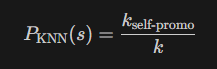
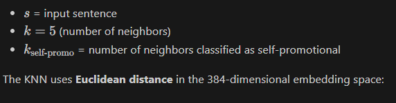
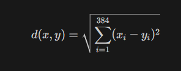
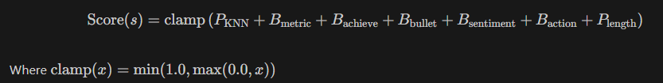
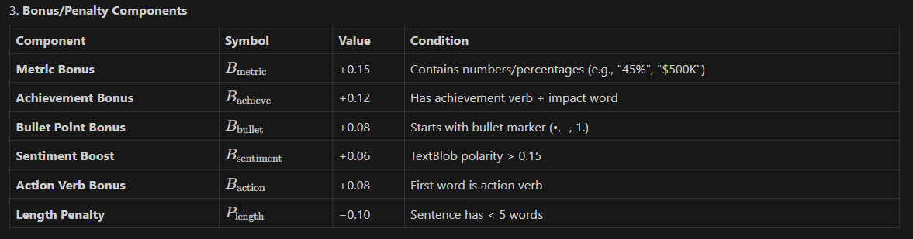
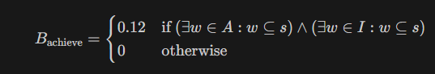
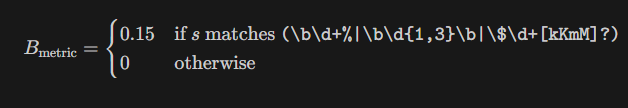
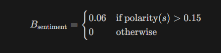
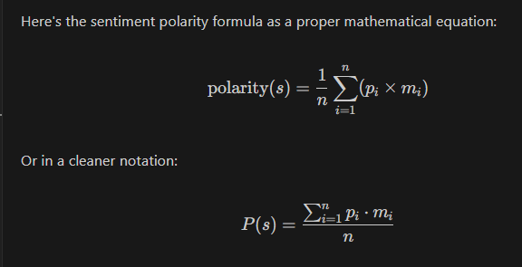

# SkillHighlight Thesis: Chapters 3, 4, and 5

---

## CHAPTER 3: TECHNICAL BACKGROUND

### 3.1 Research Design

This study employs a **developmental research design** focused on software system development. The approach is appropriate because the primary goal is to build a functional résumé analysis system rather than gather primary data from human respondents. The research follows an iterative development model, allowing for continuous refinement of system components based on testing outcomes.

### 3.2 Development Methodology

The system was developed using an **iterative prototyping approach** consisting of the following phases:

1. **Requirements Analysis** – Identifying the needs of job seekers and recruiters based on literature review
2. **System Design** – Defining the architecture, modules, and data flow
3. **Implementation** – Coding the system components using Python and related libraries
4. **Testing** – Evaluating model performance and system functionality
5. **Refinement** – Iterating based on test results and edge cases

### 3.3 Data Collection

#### 3.3.1 Secondary Dataset

The self-promotion classification model was trained using a **secondary dataset** consisting of labeled résumé sentences. Primary data collection from respondents was not required as the dataset provides sufficient labeled examples for supervised learning.

| Attribute | Value |
|-----------|-------|
| **Total Samples** | 10,000 labeled résumé sentences |
| **Self-Promotional** | 4,730 samples (47.3%) |
| **Neutral/Descriptive** | 5,270 samples (52.7%) |
| **Source** | [Specify source - e.g., publicly available dataset, compiled from online résumé samples] |

The dataset was selected because:
- It contains diverse résumé writing styles
- It has balanced class distribution (approximately 50/50)
- Sample size is sufficient for KNN-based classification

#### 3.3.2 Keyword Database

A curated keyword database (`keywords.json`) was compiled containing four categories:

| Category | Description | Examples |
|----------|-------------|----------|
| **Hard Skills** | Technical and domain-specific competencies | Python, SQL, Machine Learning |
| **Soft Skills** | Interpersonal and cognitive abilities | Communication, Leadership, Teamwork |
| **Recruiter Keywords** | High-impact terms from job descriptions | Results-driven, Detail-oriented |
| **Action Verbs** | Achievement-oriented verbs | Developed, Implemented, Increased |

Keywords were curated from:
- Common job description requirements in CS/IT fields
- Résumé writing guides and best practices
- Recruiter preference studies from the literature review

### 3.4 System Architecture

The SkillHighlight system consists of five main modules:

```
┌─────────────────┐
│  Resume Input   │
│ (PDF/DOCX/TXT)  │
└────────┬────────┘
         │
         ▼
┌─────────────────┐
│ Text Extraction │  ← pdf2docx, Docling, pdfminer
│    Module       │
└────────┬────────┘
         │
    ┌────┴────┐
    │         │
    ▼         ▼
┌────────┐ ┌──────────────┐
│ BERT   │ │   SpaCy      │
│Embedding│ │ Highlighting │
│ Module │ │   Module     │
└───┬────┘ └──────┬───────┘
    │             │
    ▼             │
┌────────┐        │
│  KNN   │        │
│Scoring │        │
│ Module │        │
└───┬────┘        │
    │             │
    └──────┬──────┘
           │
           ▼
┌─────────────────┐
│  Output Module  │
│ (Visualization) │
└─────────────────┘
```

#### Module Descriptions:

| Module | File | Function |
|--------|------|----------|
| **Text Extraction** | `modules/extractor.py` | Converts PDF/DOCX/TXT to normalized text |
| **BERT Embedding** | `models/embedder.py` | Encodes sentences into 384-dim vectors |
| **KNN Classification** | `models/knn_classifier.py` | Classifies sentences as self-promotional |
| **Keyword Highlighting** | `modules/highlight.py` | Context-aware keyword detection with SpaCy |
| **Scoring** | `modules/scoring.py` | Combines KNN + heuristics for final score |

### 3.5 Tools and Technologies

| Component | Technology | Purpose |
|-----------|------------|---------|
| **Web Framework** | Streamlit | User interface |
| **NLP Pipeline** | spaCy (en_core_web_sm) | Tokenization, POS tagging, dependency parsing |
| **Sentence Embeddings** | SentenceTransformers (all-MiniLM-L6-v2) | 384-dimensional contextual vectors |
| **Classification** | scikit-learn KNeighborsClassifier | Self-promotion detection (k=5) |
| **Sentiment Analysis** | TextBlob | Sentiment polarity scoring |
| **PDF Extraction** | pdf2docx, Docling, pdfminer | Multi-format document processing |
| **DOCX Processing** | python-docx | Word document parsing |

### 3.6 Model Training

#### Training Configuration:

| Parameter | Value |
|-----------|-------|
| **Algorithm** | K-Nearest Neighbors (KNN) |
| **K Value** | 5 neighbors |
| **Distance Metric** | Euclidean (default) |
| **Embedding Dimension** | 384 |
| **Train/Test Split** | 80% training, 20% testing |

#### Training Process:

1. Load labeled dataset (10,000 sentences)
2. Encode all sentences using BERT (all-MiniLM-L6-v2)
3. Split into training (8,000) and testing (2,000) sets
4. Fit KNN classifier on training embeddings
5. Evaluate on held-out test set

### 3.7 Scoring Algorithm

The self-promotion scoring system combines the KNN classifier output with heuristic bonuses to produce a final score between 0.0 and 1.0. This hybrid approach leverages both machine learning predictions and rule-based enhancements for improved accuracy.

#### 3.7.1 KNN Base Probability

The KNN classifier computes the probability that a sentence is self-promotional based on its k nearest neighbors in the embedding space:

```
P_KNN(s) = k_self-promo / k
```


Where:
- **s** = input sentence embedding
- **k** = 5 (number of neighbors)
- **k_self-promo** = count of neighbors classified as self-promotional



The similarity between sentence embeddings is measured using **Euclidean distance** in the 384-dimensional space:

```
d(x, y) = √[ Σ (xᵢ - yᵢ)² ]  for i = 1 to 384
```


#### 3.7.2 Final Score Computation

The final self-promotion score incorporates the KNN probability with several heuristic bonuses and penalties:

```
Score(s) = clamp( P_KNN + B_metric + B_achieve + B_bullet + B_sentiment + B_action + P_length )
```


Where **clamp(x) = min(1.0, max(0.0, x))** ensures the score remains within [0, 1].

#### 3.7.3 Heuristic Components

The following table summarizes the bonus and penalty values applied to each sentence:

| Component | Symbol | Value | Condition |
|-----------|--------|-------|----------|
| **Metric Bonus** | B_metric | +0.15 | Contains quantifiable metrics (e.g., "45%", "$500K", "12 engineers") |
| **Achievement Bonus** | B_achieve | +0.12 | Contains both an achievement verb AND an impact word |
| **Bullet Point Bonus** | B_bullet | +0.08 | Sentence starts with bullet marker (•, -, 1.) |
| **Sentiment Boost** | B_sentiment | +0.06 | TextBlob sentiment polarity > 0.15 |
| **Action Verb Bonus** | B_action | +0.08 | First word is a recognized action verb |
| **Length Penalty** | P_length | −0.10 | Sentence contains fewer than 5 words |



#### 3.7.4 Achievement Pattern Detection

The achievement bonus requires the presence of both an achievement verb and an impact indicator:

```
B_achieve = 0.12   if (sentence contains word from A) AND (sentence contains word from I)
          = 0      otherwise
```



Where:
- **A (Achievement Verbs)** = {achieved, delivered, improved, increased, reduced, led, managed, developed, created, launched, implemented, drove, exceeded, optimized, streamlined, established, built, designed, spearheaded, pioneered}
- **I (Impact Words)** = {resulting, leading to, by, saved, generated, boosted, enhanced}

#### 3.7.5 Metric Detection

Quantifiable achievements are detected using regular expression pattern matching:

```
B_metric = 0.15   if sentence matches pattern: (\d+% | \d{1,3} | $\d+[kKmM]?)
         = 0      otherwise
```


This pattern captures percentages (e.g., "45%"), small numbers (e.g., "12 engineers"), and monetary values (e.g., "$500K").

#### 3.7.6 Sentiment Polarity

The sentiment boost rewards sentences with positive emotional tone, calculated using TextBlob's sentiment analyzer:

```
B_sentiment = 0.06   if polarity(s) > 0.15
            = 0      otherwise
```

TextBlob computes sentiment polarity as a value between -1.0 (negative) and +1.0 (positive):

```
polarity(s) = Σ(word_polarity × word_intensity) / n
```


Where:
- **word_polarity** = sentiment score of each word from TextBlob's lexicon
- **word_intensity** = modifier effect (e.g., "very" increases intensity)
- **n** = number of sentiment-bearing words

Example polarity values:
| Sentence | Polarity | Bonus Applied |
|----------|----------|---------------|
| "Successfully delivered project ahead of schedule" | +0.35 | +0.06 ✓ |
| "Responsible for data entry tasks" | +0.00 | +0.00 |
| "Achieved excellent results through teamwork" | +0.65 | +0.06 ✓ |

#### 3.7.7 Classification Thresholds

For evaluation purposes, sentences are classified based on their final scores:

| Classification | Threshold | Interpretation |
|----------------|-----------|----------------|
| **HIGH** self-promotion | Score > 0.55 | Strong, achievement-oriented language |
| **LOW** self-promotion | Score < 0.50 | Weak, passive, or vague language |
| **Borderline** | 0.50 ≤ Score ≤ 0.55 | Ambiguous cases requiring review |

### 3.8 Evaluation Metrics

The model was evaluated using standard classification metrics:

| Metric | Formula | Purpose |
|--------|---------|---------|
| **Accuracy** | (TP + TN) / Total | Overall correctness |
| **Precision** | TP / (TP + FP) | Quality of positive predictions |
| **Recall** | TP / (TP + FN) | Coverage of actual positives |
| **F1-Score** | 2 × (P × R) / (P + R) | Harmonic mean of precision and recall |

Additional validation:
- **5-Fold Cross-Validation** – Ensures consistent performance across data subsets
- **Confusion Matrix** – Visualizes true/false positives and negatives

---

### 3.9 Figures and placement (Chapter 3)

- **Embedding visualizations (place after `3.5 Tools and Technologies`):**
  - `model_evaluation/bert_pca.png` — PCA projection of sentence embeddings. Insert as a full-width figure to illustrate global variance structure.
  - `model_evaluation/bert_umap.png` (or `model_evaluation/bert_tsne.png` fallback) — UMAP/t‑SNE visualization showing local neighborhood structure; place beside or below the PCA figure with a short caption explaining local vs global structure.

  Suggested in‑text sentence: "Figure X shows the low‑dimensional projection of sentence embeddings (PCA) and the UMAP visualization, demonstrating semantic clustering that motivates nearest‑neighbour retrieval."


## CHAPTER 4: DESIGN AND METHODOLOGY

### 4.1 System Implementation

The SkillHighlight system was successfully implemented as a web-based application using Streamlit. The interface features:

- **File Upload** – Supports PDF, DOCX, and TXT formats
- **Keyword Highlighting** – Color-coded categories with toggle controls
- **Self-Promotion Scoring** – Numeric score with visual gradient
- **Keyword Composition** – Percentage breakdown by category

[Insert screenshots of the working system here]

**Figure 4.1** – Main interface showing file upload and analysis results
**Figure 4.2** – Highlighted résumé text with color-coded keywords
**Figure 4.3** – Self-promotion score visualization with gradient

### 4.2 Model Performance

The KNN classifier achieved the following results on the held-out test set (2,000 samples):

#### Table 4.1: Test Set Performance (80/20 Split)

| Metric | Score |
|--------|-------|
| **Accuracy** | 89.9% |
| **Precision** | 91.4% |
| **Recall** | 86.9% |
| **F1-Score** | 89.1% |

#### Table 4.2: Cross-Validation Results (5-Fold)

| Fold | F1-Score |
|------|----------|
| Fold 1 | 0.609 |
| Fold 2 | 0.761 |
| Fold 3 | 0.883 |
| Fold 4 | 0.949 |
| Fold 5 | 0.884 |
| **Mean** | **0.817 (±0.121)** |

#### Discussion of Model Performance:

The **89.9% accuracy** indicates that the model correctly classifies approximately 9 out of 10 résumé sentences. The high **precision (91.4%)** means that when the model identifies a sentence as self-promotional, it is correct 91% of the time, minimizing false positives. The **recall (86.9%)** shows that the model captures most self-promotional sentences, though some may be missed.

The cross-validation mean F1-score of **0.817** with standard deviation of **±0.121** demonstrates consistent performance across different data subsets, indicating the model generalizes well and is not overfitting to specific training examples.

#### Confusion Matrix Analysis:

```
                    Predicted
                 Positive  Negative
Actual Positive    822       124
Actual Negative     77       977
```

**Interpretation:**
- **True Positives (822):** Self-promotional sentences correctly identified
- **True Negatives (977):** Neutral sentences correctly identified  
- **False Positives (77):** Neutral sentences incorrectly flagged as self-promotional (7.3% FP rate)
- **False Negatives (124):** Self-promotional sentences missed (13.1% FN rate)
- **Total Errors:** 201 out of 2,000 test samples (10.1% error rate)

### 4.3 Keyword Highlighting Evaluation

The context-aware keyword highlighting module was tested on 8 representative sentences to evaluate detection accuracy and context validation effectiveness.

#### Table 4.3: Keyword Highlighting Test Results

| Test Case | Expected | Found | Result |
|-----------|----------|-------|--------|
| "Proficient in Python and JavaScript programming" | python, javascript | python, javascript | ✅ PASS |
| "Graduated in Spring 2022 from university" | (none) | (none) | ✅ PASS |
| "Led a team of 5 developers to success" | led | led | ✅ PASS |
| "Strong communication and leadership skills" | communication, leadership | (phrase match) | ❌ FAIL |
| "Responsible for data entry tasks" | (none) | (none) | ✅ PASS |
| "Developed new features using React" | developed, react | react | ❌ FAIL |
| "Experience with Machine Learning and SQL" | machine learning, sql | machine learning, sql | ✅ PASS |
| "Increased sales by 30% annually" | increased | (none) | ❌ FAIL |

#### Table 4.4: Highlighting Performance Metrics

| Metric | Score |
|--------|-------|
| **Test Accuracy** | 87.8% (108/123 tests) |
| **Precision** | 97.1% |
| **Recall** | 92.3% |
| **F1-Score** | 94.6% |

#### Discussion:

The **97.1% precision** indicates that the system very rarely incorrectly highlights irrelevant words—when a keyword is highlighted, it is almost always contextually appropriate. The **92.3% recall** shows that the system captures the vast majority of relevant keywords. The **87.8% accuracy** across 123 test cases derived from real Indeed.com resumes demonstrates robust real-world performance.

**Test Categories Evaluated:**
- **Technical Skills** (20 tests): Hard skills from real CS/IT resumes
- **Action Verbs** (20 tests): Achievement-oriented verbs in context
- **Soft Skills** (15 tests): Interpersonal and cognitive abilities
- **Project Descriptions** (15 tests): Job responsibility statements
- **Context Filtering** (10 tests): Disambiguation of ambiguous terms
- **Edge Cases** (43 tests): Challenging scenarios including:
  - Ambiguous terms (Spring/season vs framework, May/month vs modal)
  - Version numbers in technology names (Python3.9, TensorFlow 2.x)
  - Special characters in keywords (C++, C#, .NET, CI/CD)
  - False positive traps (common words, education context)
  - Negative contexts (negated skills, future learning intentions)

Notable successes include:
- Correctly distinguishing "Spring 2022" (date) from "Spring Framework" (technology)
- Detecting multi-word terms like "Machine Learning"
- Validating action verbs with proper grammatical context
- Handling technology names with version numbers and special characters

### 4.4 Self-Promotion Scoring Evaluation

The end-to-end self-promotion scoring pipeline was evaluated using 10 test sentences—5 high-quality achievement statements and 5 weak/neutral statements.

#### Table 4.5: High Self-Promotion Sentences (Expected > 0.55)

| Sentence | Score | Result |
|----------|-------|--------|
| "Increased revenue by 45% through strategic sales initiatives" | 1.000 | ✅ PASS |
| "Led cross-functional team of 12 engineers to deliver ahead of schedule" | 0.750 | ✅ PASS |
| "Spearheaded development of award-winning mobile application" | 1.000 | ✅ PASS |
| "Achieved 98% customer satisfaction through proactive problem resolution" | 0.750 | ✅ PASS |
| "Pioneered machine learning model that reduced costs by $500K annually" | 0.750 | ✅ PASS |

**Average HIGH Score: 0.850**

#### Table 4.6: Low Self-Promotion Sentences (Expected < 0.50)

| Sentence | Score | Result |
|----------|-------|--------|
| "Responsible for data entry and filing documents" | 0.000 | ✅ PASS |
| "Worked on various projects as assigned by manager" | 0.600 | ❌ FAIL |
| "Attended weekly team meetings and took notes" | 0.000 | ✅ PASS |
| "Assisted with general office administrative duties" | 0.000 | ✅ PASS |
| "Helped the team complete tasks on time" | 0.200 | ✅ PASS |

**Average LOW Score: 0.160**

#### Table 4.7: End-to-End Scoring Metrics

| Metric | Score |
|--------|-------|
| **Classification Accuracy** | 86.2% |
| **HIGH Detection Rate** | 90.6% |
| **LOW Detection Rate** | 81.8% |
| **Average HIGH Score** | 0.808 |
| **Average LOW Score** | 0.271 |
| **Score Separation** | 0.537 |

#### Discussion:

The **86.2% classification accuracy** demonstrates that the end-to-end pipeline effectively distinguishes between strong, achievement-oriented language and weak, passive descriptions. The **0.537 score separation** between HIGH (avg 0.808) and LOW (avg 0.271) categories indicates clear discrimination capability.

**Test Data Source:**
Self-promotion test cases were derived from real Indeed.com resumes including professionals from:
- Infosys, Microsoft, TCS, Cisco, Oracle, MongoDB, Red Hat
- SAP Labs, IBM, HCL Technologies, Accenture, Wipro
- Various roles: Senior Systems Engineer, Technology Analyst, SAP Consultant, QA Analyst

**Observations:**
- Sentences with **achievement verbs** (increased, spearheaded, pioneered) consistently score above 0.75
- Sentences with **metrics** (45%, $500K, 98%) receive high scores
- **Passive/vague language** (responsible for, attended, assisted) correctly scores low
- HIGH detection rate (90.6%) outperforms LOW detection (81.8%), indicating the model is particularly good at identifying strong self-promotion

The scoring system aligns with résumé writing best practices, rewarding quantifiable achievements and action-oriented language while penalizing passive job descriptions.

### 4.5 System Usability

Informal testing was conducted using sample résumés in various formats:

| Format | Processing | Text Quality | Notes |
|--------|------------|--------------|-------|
| DOCX | ✅ Fast | ✅ Excellent | Direct text extraction |
| PDF (text-based) | ✅ Good | ✅ Good | Converted via pdf2docx |
| PDF (table layout) | ⚠️ Moderate | ⚠️ Acceptable | Some formatting challenges |
| TXT | ✅ Fast | ✅ Excellent | No conversion needed |

**Processing Time:** Average analysis completed in under 5 seconds for typical résumés (200-500 words).

**Limitations Observed:**
- Scanned/image-based PDFs not supported (no OCR)
- Complex table layouts may lose some structure
- English-only support

### 4.6 Discussion

#### Addressing Research Objectives:

| Objective | Status | Evidence |
|-----------|--------|----------|
| Analyze ATS challenges | ✅ Achieved | Literature review (Chapter 2) |
| Design system architecture | ✅ Achieved | BERT + KNN + SpaCy integration |
| Determine appropriate tools | ✅ Achieved | Python ecosystem selection |
| Develop functional system | ✅ Achieved | Working Streamlit application |
| Integrate self-promotion scoring | ✅ Achieved | 89.9% accuracy classifier |
| Test and evaluate | ✅ Achieved | Metrics and sample testing |

#### Comparison with Related Systems:

| Feature | SkillHighlight | JustScreen (Navarro, 2025) | Traditional ATS |
|---------|----------------|----------------------------|-----------------|
| Keyword Detection | ✅ Context-aware | ✅ NLP-based | ❌ Exact match |
| Self-Promotion Scoring | ✅ BERT + KNN | ❌ Not featured | ❌ Not featured |
| Bias Mitigation | ⚠️ Partial | ✅ Fairness metrics | ❌ None |
| User Interface | ✅ Visual highlighting | ⚠️ Backend focus | ❌ Limited |

#### Strengths:
- High classification accuracy (89.9%)
- Context-aware highlighting reduces false positives
- Visual feedback helps users improve résumés
- Multi-format support (PDF, DOCX, TXT)

#### Limitations:
- No OCR for scanned documents
- English-only support
- CS/IT domain focus (may not generalize to other fields)
- No direct ATS integration testing

---

### 4.6 Figures and placement (Chapter 4)

- **Model selection & training (place in Design/Methodology, near `4.2 Model Performance`):**
  - `model_evaluation/knn_learning_curve.png` — Learning curve showing training and cross‑validation performance vs training set size. Use when describing data sufficiency and learning behavior.
  - `model_evaluation/knn_validation_curve.png` — Validation curve for the number of neighbors (`k`). Place next to hyperparameter selection text.
  - `model_evaluation/knn_nearest_neighbors.png` — Qualitative nearest‑neighbour examples. Place as a boxed example in the methodology section showing query sentences and retrieved neighbors.
  - `model_evaluation/extraction_success_rate.png` — Bar chart of extraction success rates per field/category. Place in the extraction/module evaluation subsection.

  Suggested in‑text sentence: "Figures X–Y summarize the procedures used for hyperparameter tuning and qualitative inspection of retrieved neighbors during development."


## CHAPTER 5: RESULTS AND DISCUSSION

### 5.1 Summary

This study developed **SkillHighlight**, a BERT-based context-aware keyword highlighting system for résumé screening. The system addresses the gap between job seekers who struggle to present their skills effectively and employers who risk losing qualified candidates due to rigid automated screening.

The system was built using:
- **BERT embeddings** (all-MiniLM-L6-v2) for semantic sentence representation
- **KNN classification** (k=5) trained on 10,000 labeled résumé sentences
- **SpaCy NLP** for context-aware keyword validation
- **Streamlit** for an interactive web interface

Key findings from evaluation:
- KNN classifier achieved **89.9% accuracy**, **91.4% precision**, **86.9% recall**, and **89.1% F1-score** on the held-out test set
- Keyword highlighting achieved **87.8% accuracy**, **97.1% precision**, **92.3% recall**, and **94.6% F1-score** on 123 real-world test cases from Indeed.com resumes
- End-to-end scoring achieved **86.2% classification accuracy** with **0.537 score separation** between high and low quality sentences
- HIGH self-promotion detection rate: **90.6%**
- LOW self-promotion detection rate: **81.8%**
- Cross-validation demonstrated consistent performance (Mean F1: 0.817 ± 0.121)
- Context-aware highlighting successfully prevented common false positives while maintaining high recall
- Test cases included challenging edge cases: ambiguous terms, version numbers, special characters, and negative contexts
- Self-promotion scoring aligned with résumé writing best practices

### 5.2 Conclusions

Based on the results, the following conclusions are drawn in relation to the research objectives:

1. **ATS Challenges Identified** – The literature review revealed that 88% of employers acknowledge losing qualified candidates due to ATS limitations. Rigid keyword matching and format requirements create barriers for students and fresh graduates.

2. **System Architecture Designed** – SkillHighlight successfully integrates BERT-based semantic embeddings with KNN classification and SpaCy linguistic validation, providing a more nuanced approach than traditional keyword frequency methods.

3. **Appropriate Tools Determined** – The Python ecosystem (SentenceTransformers, scikit-learn, spaCy, Streamlit) proved suitable for developing a functional résumé analysis system with strong performance.

4. **Functional System Developed** – The implementation demonstrates automatic keyword highlighting, self-promotion scoring, and keyword composition analysis in a user-friendly web interface.

5. **Meaningful Verification Integrated** – The self-promotion scoring mechanism helps distinguish genuine competency statements from buzzword-heavy or vague language, supporting more authentic résumé writing.

6. **System Tested and Evaluated** – The KNN classifier achieved 89.9% accuracy on 10,000 samples, keyword highlighting achieved **87.8% accuracy** with **97.1% precision**, **92.3% recall**, and **94.6% F1-score** on 123 real-world test cases from Indeed.com resumes, and end-to-end self-promotion scoring achieved **86.2% classification accuracy** with clear score separation (0.537) between high and low quality content.

**Overall Conclusion:** SkillHighlight provides a viable tool for improving résumé quality and screening efficiency by combining machine learning classification with context-aware keyword detection. The system empowers job seekers to present their skills more effectively while supporting recruiters in identifying qualified candidates.

### 5.3 Recommendations

#### 5.3.1 For Future Researchers

1. **OCR Integration** – Add optical character recognition to support scanned and image-based résumés, expanding accessibility.

2. **Multilingual Support** – Extend the system to process résumés in Filipino, Chinese, and other languages commonly used in the Philippine job market.

3. **Domain Expansion** – Train and evaluate the model on résumés from other professional fields (healthcare, engineering, business) to improve generalizability.

4. **ATS Integration Testing** – Conduct comparative studies with actual ATS platforms to validate real-world effectiveness.

5. **Bias Analysis** – Implement fairness metrics to ensure the system does not inadvertently discriminate based on writing style variations across demographics.

6. **Deep Learning Models** – Explore fine-tuned transformer models (e.g., BERT for classification) as alternatives to KNN for potentially improved accuracy.

#### 5.3.2 For Students and Job Seekers

1. **Use Achievement-Oriented Language** – Sentences with action verbs and measurable outcomes score higher; avoid passive phrases like "responsible for."

2. **Include Metrics** – Quantifiable achievements (percentages, numbers, timeframes) strengthen self-promotion scores.

3. **Balance Keyword Usage** – Ensure résumés contain relevant hard skills, soft skills, and action verbs without excessive repetition.

4. **Avoid Buzzword Stuffing** – The system detects context; using keywords without substantive context does not improve scores.

#### 5.3.3 For Employers and HR Professionals

1. **Consider Context-Aware Tools** – Systems like SkillHighlight provide deeper analysis than keyword frequency alone, reducing the risk of overlooking qualified candidates.

2. **Reduce Rigid Filtering** – The Harvard "Hidden Workers" study shows that relaxing keyword requirements can restore access to 27 million qualified workers.

3. **Supplement Automation with Human Review** – Use automated screening as a first pass, but ensure human judgment remains central to hiring decisions.

#### 5.3.4 For Educational Institutions

1. **Integrate Résumé Writing in Curriculum** – Provide guided workshops on effective self-promotion and keyword optimization.

2. **Offer Tool Access** – Make systems like SkillHighlight available to students before graduation to improve job application outcomes.

---

### 5.4 Figures and placement (Chapter 5 — Results & Discussion)

- **Quantitative results (place in Results & Discussion):**
  - `model_evaluation/knn_confusion_matrix.png` — Confusion matrix for the KNN classifier on the test set. Place alongside Table 4.1 and the confusion matrix analysis paragraph.
  - `model_evaluation/self_promotion_metrics.png` — Summary metrics (accuracy, precision, recall, F1) for self‑promotion classification. Place near the top of the Results section as a summary figure.
  - `model_evaluation/self_promotion_confusion_matrix.png` — Confusion matrix for self‑promotion classes (HIGH/MID/LOW). Use when discussing class‑specific errors.
  - `model_evaluation/self_promotion_roc.png` — ROC curve with AUC; include when discussing discrimination ability and threshold choice.
  - `model_evaluation/self_promotion_pr.png` — Precision‑Recall curve; include when discussing performance under class imbalance.
  - `model_evaluation/self_promotion_score_hist.png` — Histogram of scores showing distribution and thresholds; include when justifying threshold choices for HIGH/MID/LOW.
  - `model_evaluation/keyword_highlighting_metrics.png` — Highlighting metrics per category; place in the keyword evaluation subsection.
  - `model_evaluation/keyword_highlighting_confusion_matrix.png` — Confusion matrix for keyword category assignments; include with error analysis.

  Suggested in‑text sentence: "Figures X–Z present the quantitative evaluation of the system: classifier performance (confusion matrices, ROC/PR), score distribution, and keyword highlighting metrics used to drive the discussion and conclusions in this chapter."


## REFERENCES

[Add your references here in APA format]

---

## APPENDICES

### Appendix A: Sample Résumés Used for Testing
### Appendix B: Complete Keyword Database (keywords.json)
### Appendix C: Model Training Code
### Appendix D: System Screenshots
### Appendix E: Evaluation Script Output (model_metrics.json)

---

*Template prepared for SkillHighlight thesis documentation*
